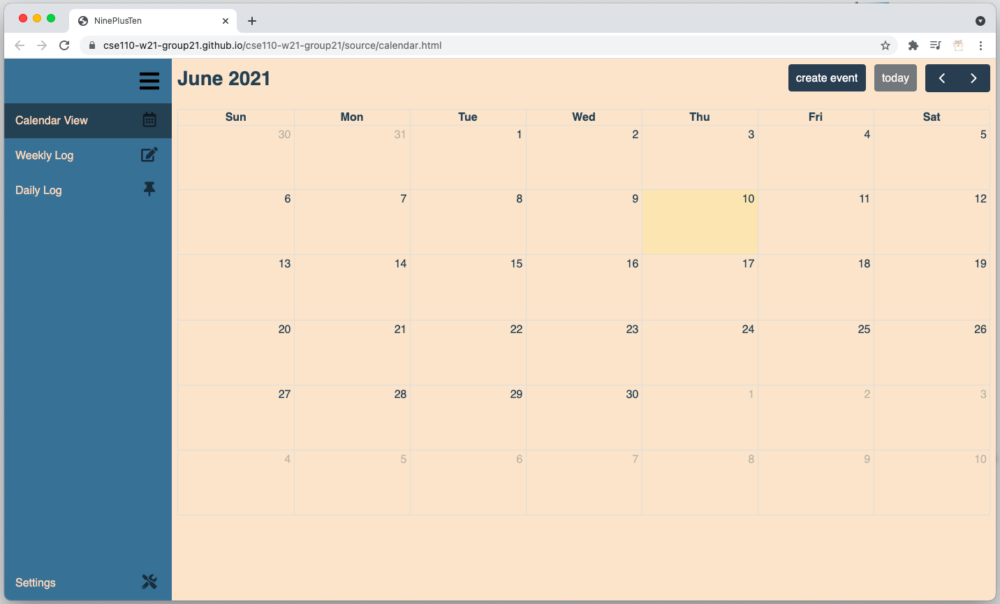

# Group 21 - NinePlusTen
#### Developed by: Alexander Berryhill-Williams, Thomas Garry, Judy Liu, Jarrett Ratelle, Jerry Guo, Tyler Holston, Lucas Bajoua

## Product
Here is the link to [NinePlusTen Bullet Journal](https://cse110-w21-group21.github.io/cse110-w21-group21/source/calendar.html)

## Videos
- [Status Check 1](https://youtu.be/oNg_tGI5dPE)
- [CI/CD Pipeline demo](https://youtu.be/IRaP0pxyPBc)
- [final video public version](https://youtu.be/jimtNd14Gvc)
- [final video private version](https://youtu.be/e5FtLgOboHE)

## Documentations
- [Architecture Docs]()
- [End User Doc](./docs/admin/end-user/end-user-doc.md)
- [Onboarding Doc](./docs/admin/onboarding.md), click on it to learn how to contribute to the BuJo App
- [JSDoc](https://cse110-w21-group21.github.io/cse110-w21-group21/out/index.html)
- [CI/CD Pipeline](./admin/cipipeline/phase1.md)

## Design
- To address functional requirement that is architecturally significant, we have created six different [**Architecture Decision Records**](./specs/adrs/). 
- In the [**Starting Pitch**](./docs/misc/starting-pitch.pdf), we first describe the problem that we are trying to solve, then come up with user personas, and develop a solution. We have also included our initial designs like Fat Marker Sketch and wireframe, acknowledged the rabbet holes, and brought up some no-go's.
- In the [**Miro (Password: NinePlusTen)**](https://miro.com/app/board/o9J_lJdxiAU=/), we have the **high and low-fidelity designs**, some feature ideas, and user personas.

## Sprints
#### Two sprints after the brainstorm and the design, each follows the guidance of agile.
- Sprint 1
    - [Sprint Planning](./docs/admin/meetings/051021-meeting.md)
    - [Sprint Review](./docs/admin/meetings/051621-sprint-1-review.md)
    - [Retrospective](./docs/admin/meetings/051821-retrospective.md)
- Sprint 2
    - [Sprint Planning](./docs/admin/meetings/051921-sprint.md)
    - [Sprint Review](./docs/admin/meetings/053021-sprint-2-review.md)
    - [Retrospective](./docs/admin/meetings/053021-retrospective.md)

## Admins
- You can see all the meeting notes [here](./docs/admin/meetings)
- The signed contract is included [here](./admin/misc)
- Standup meeting records listed [here](./docs/admin/daily-standups)

## Source

- [/source](./source) folder includes all source and test code of BuJo App. It contains a "scripts" folder that contains all .js files, a "stylesheets" folder that contains all .css files, and a "test" folder that contains all .test.js files.

## Testing
We have implemented unit and E2E test using jest-puppeteer. To install and run tests, type `npm install` and `npm run test` commands in terminal.

## About us:

- [Github organization](https://github.com/cse110-w21-group21)
- [Get to know us!](./docs/admin/team.md)
- [Slack](cse110-sp21-group21.slack.com)
