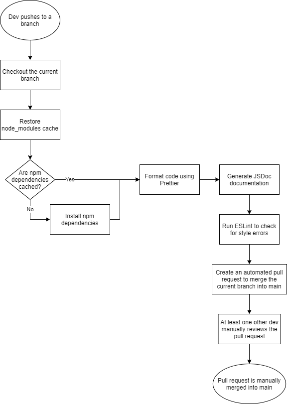

# CI/CD Pipeline Status

Description: Continuous Integeration (CI) is one of the core practices of DevOps. When developers commit their code to the repository, it will trigger the automated workflow on the CI server that can notify developers of any issues integrating their changes. 

The final goal of otu CI/CD pipeline is to have repetitive tasks automated, these includes linting and code style enforcement, review code quality via tool, review code quality via human review, unit tests via automation, and documentation generation via automation.

## Current Functionalities

In our current workflow, it will turn on with every push to a branch. The event triggers a job that runs on a Linux container in the cloud, then we tell the container what to do as a series of steps fo the job "Formatting-and-linting":
1. In the step named: "Checkout source code", it will move content from the repository into the workspace, it only reads from the repository but writes to the workspace.
2. In the step named "Restore node_modules cache", it allows caching dependencies and build outputs to improve workflow execution time.
3. In the step named "Install npm dependencies", we ensure every dependencies are installed
4. In the step named "Code formatting with Prettier", it will run the Prettier script to format the code.
5. In the step named "JS Docs", it will build a JavaScript documentatio with JSDoc.
6. In the step named "ESlint", it will run the ESlint script to identify problematic patterns in javascript code.
7. In the step named "pull-request", it will automatically create a pull request with customized title and body, where the source-branch is the triggered branch, destination branch is the main brnach.

Below is a diagram of the current Continuous Integration Workflow

## Planned/In Progress Functionalities

We are currently working on unit tests and end to end tests automation. The planned functionalities of our pipeline include automating the process of:
- Code quality via tool
- Code coverage reporting, packaging, deployment and minification.