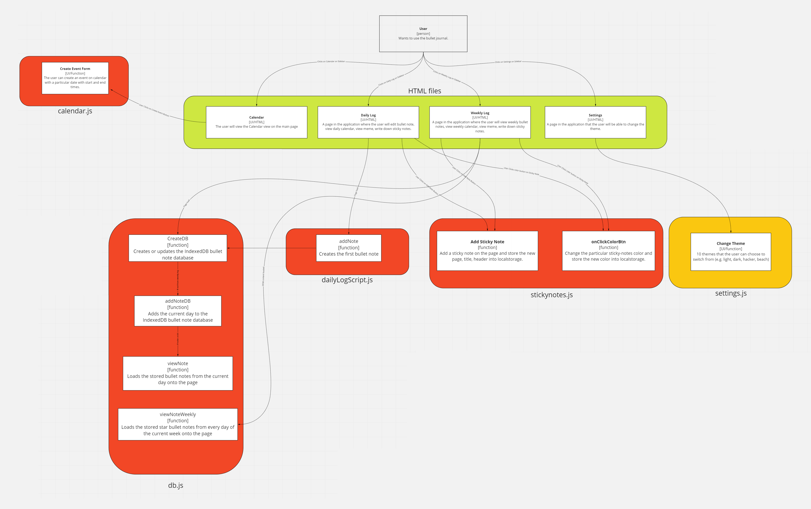
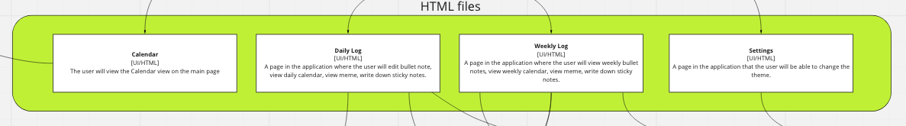
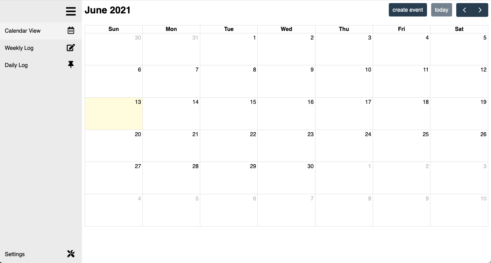
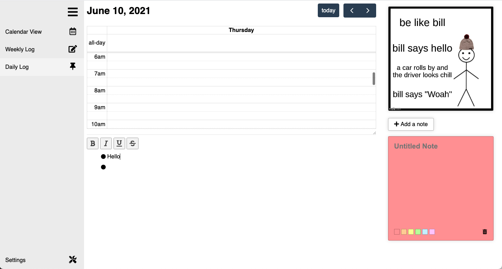
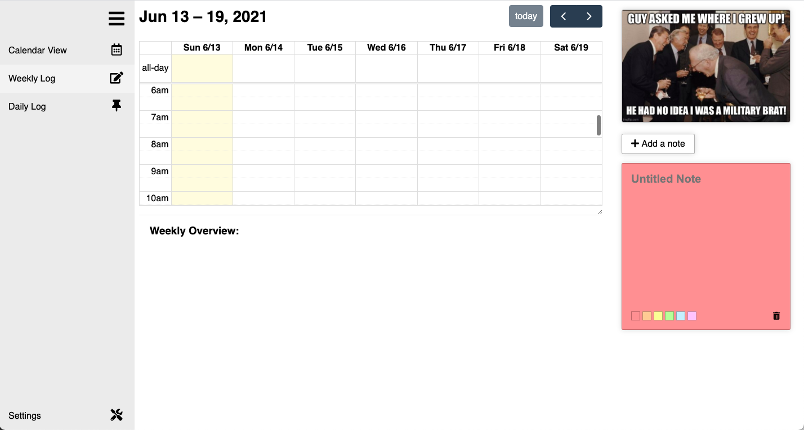
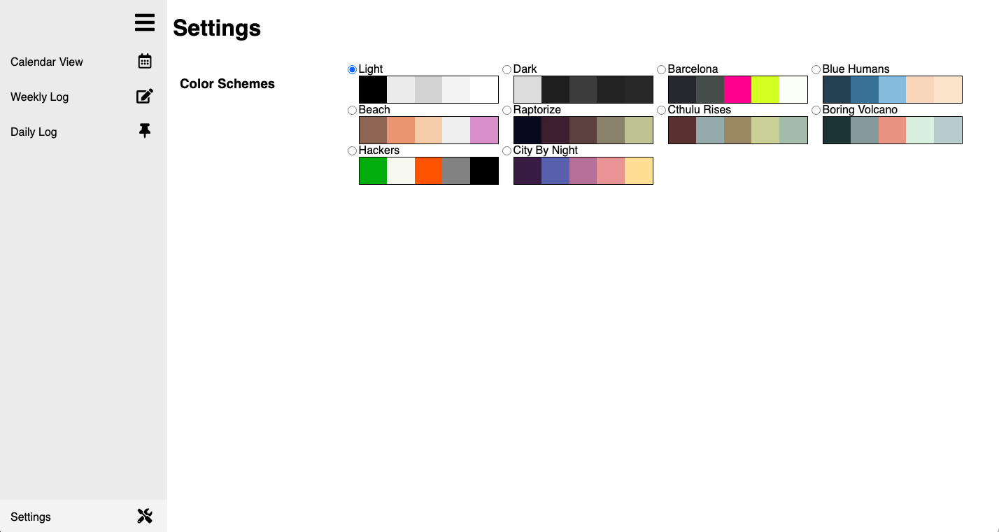

# Architecture Overview

https://miro.com/app/board/o9J_l_KVeGw=/

## Overview
The entire codebase contains four main HTML files that the user can access through buttons on the sidebar left of the page.

### Calendar View

HTML Files:
- calendar.html - The HTML document for the Calendar View page, as seen above. Contains the HTML for the sidebar, the FullCalendar, the Create Event form, and the the Edit Event form.

CSS Files:
- style.css - Global CSS style sheet, contains sidebar CSS and CSS for the different themes.
- calendarView.css - The CSS style sheet for the Calendar View page. Contains the CSS for the Create Event form and Edit Event form.

JavaScript Files:
- script.js - Global JavaScript file. Contains code for the collapsable sidebar menu and for loading themes from localstorage
    - `toggleMenu()` - function for expanding and collapsing the sidebar menu by changing the style of the element
- calendar.js - JavaScript file for the calendar view.
    - `createCalendar(data)` - function for rendering the calendar on the calendar view, 'data' should contain the events from local storage
    - `popCreate` - Object used for rendering the Create Event form
        - `open` - function for opening the Create Event form
        - `close` - function for closing the Create Event form
    - `popEdit` - Object used for rendering the Edit Event form
        - `open` - function for opening the Edit Event form
        - `close` - function for closing the Edit Event form
        - `delete` - function for deleting the selected event
    - `formatDate()` - function for formatting date to proper fullcalendar syntax

### Daily Log View

HTML Files: 
- dailyLog.html - The HTML document for the Daily Log page. A page in the application where the user will be able to edit daily bullet notes, view daily calendar, view meme, write down sticky notes.

CSS Files:
- style.css - Global CSS style sheet, contains sidebar CSS and CSS for the different themes.
- dailyLogStyle.css - CSS style sheet for the daily log page
- stickyNotes.css - CSS style sheet for the sticky notes
- notesStyle.css - CSS style sheet for the bullet notes, including bullet icon dropdown

JavaScript Files:
- dailyLogScript.js - JavaScript file for the Daily Log page. Mostly contains code for the bullet note list.
    - `BulletNote` - custom HTML element used to create each new bullet note
    - `addNote()` - function for creating the first blank note when there are no other notes in the list
    - `deleteNote(e)` - function used for deleting a note, 'e' is the delete note button element
    - `loadDropdowns()` - function used to load the event listeners for the buller icon dropdown of each bullet note after loading them from IndexedDB
- db.js - JavaScript file for saving and loading bullet notes using IndexedDB
    - `viewNote(myCallback)` - function used to load bullet notes from IndexedDB storage, 'myCallback' is a callback function that is run once the bullet notes have been loaded
    - `addNoteDB(fromWeekly,myCallback)` - function used to add a bullet note to the database, 'fromWeekly' is a boolean to check if the function is being called from Weekly Log, 'myCallback' is a callback function
    - `createDB(fromWeekly,myCallback)` - function used to create an IndexedDB database for the bullet note list
    - `updateNote()` - function used to save the current bullet list by updating the IndexedDB database
- memeGenerator.js - responsible for generating new memes upon page refresh
- dailyLogCalendar.js - JavaScript file for the daily log mini calendar.
    - `createCalendar(data)` - function for rendering the mini calendar on the daily log, 'data' should contain the events from local storage
- stickyNotes.js - JavaScript file responsible for localstorage of sticky note, buttons on the sticky notes (e.g. change color, add note, delete note.)
    - Local Storage
        - `saveHeader()` - saves the header data upon key down of user in notepad header
        - `saveBody()` - saves the body data upon key down of user in notepad body
        - `document.addEventListener('DOMContentLoaded', function(event))` - onloading of the page will render the notepads from the stored data in localstorage
        
### Weekly Log View

HTML Files:
- weeklyLog.html - The HTML document for the Weekly Log page. A page in the application where the user will be able to see weekly overview, view weekly calendar, view meme, write down sticky notes.

CSS Files:
- style.css - Global CSS style sheet, contains sidebar CSS and CSS for the different themes.
- weeklyLogStyle.css - CSS style sheet for the weekly log page
- stickyNotes.css - CSS style sheet for the sticky notes
- notesStyle.css - CSS style sheet for the bullet notes, including bullet icon dropdown

JavaScript Files:
- weeklyLogScript.js - JavaScript file for the Weekly Log page.
    - `createCalendar(data)` - function for rendering the mini calendar on the weekly log, 'data' should contain the events from local storage
- db.js - JavaScript file for saving and loading bullet notes using IndexedDB
    - `viewNoteWeekly(date)` - function used to load starred bullet notes for each day of the week from IndexedDB storage, 'date' is the date to load them from
    - `addNoteDB(fromWeekly,myCallback)` - function used to add a bullet note to the database, 'fromWeekly' is a boolean to check if the function is being called from Weekly Log, 'myCallback' is a callback function
    - `createDB(fromWeekly,myCallback)` - function used to create an IndexedDB database for the bullet note list
- memeGenerator.js - responsible for generating new memes upon page refresh
- stickyNotes.js - JavaScript file responsible for localstorage of sticky note, buttons on the sticky notes (e.g. change color, add note, delete note.)
    - Local Storage
        - `saveHeader()` - saves the header data upon key down of user in notepad header
        - `saveBody()` - saves the body data upon key down of user in notepad body
        - `document.addEventListener('DOMContentLoaded', function(event))` - onloading of the page will render the notepads from the stored data in localstorage

### Settings View

HTML Files:
- settings.html - The HTML document for the Settings page. A page in the application where the user can select for a particular color scheme.

CSS Files:
- settingsStyle.css
    - contains the css the settings page in general and css for 10 different themes

JavaScript Files:
- settings.js
    - every time the user selects a particular scheme, for example `scheme-light`, it would be added to the `document.body.classList` and `document.getElementById("sidebar").classList` while the other 9 schemes are removed from the classList.
