# Nine Plus Ten - End User Documentation

Here you can find a brief overview of how to use this bullet journal web application

## Sidebar

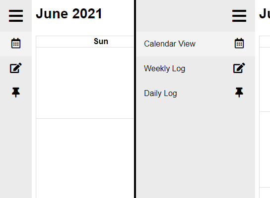

The sidebar is used to navigate between the different pages of the web app. Clicking the hamburger icon at the top will expand or collapse the sidebar.

## Calendar View

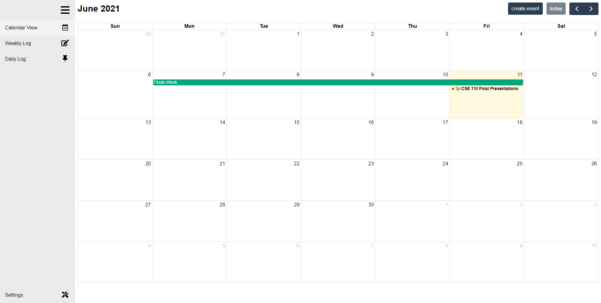

On the calendar view, you can find a monthly calendar that will display your events. You can navigate through different months using the arrow buttons on the top right, and the "today" button will bring you back to the current month.

### Create Event

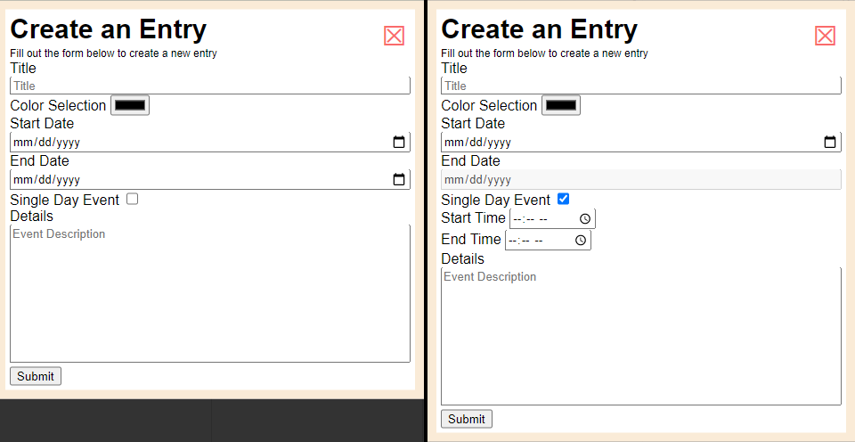

Clicking the "Create Event" button will pull up a form allowing you to create a new event. You can set the title, color, and details for any event. Multi day events will allow you to set a start date and end date. Single day events will allow only a start date, but can also include a start time and end time. These can be toggled using the checkbox. Once all the information has been entered, clicking "Submit" will create the event.

### Edit Event

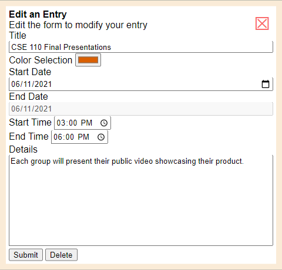

Clicking on an event from the calendar view will allow you to edit that event. This form functions the same way as the new event form. You can also delete the event from here using the "Delete" button at the bottom.

## Weekly and Daily Logs

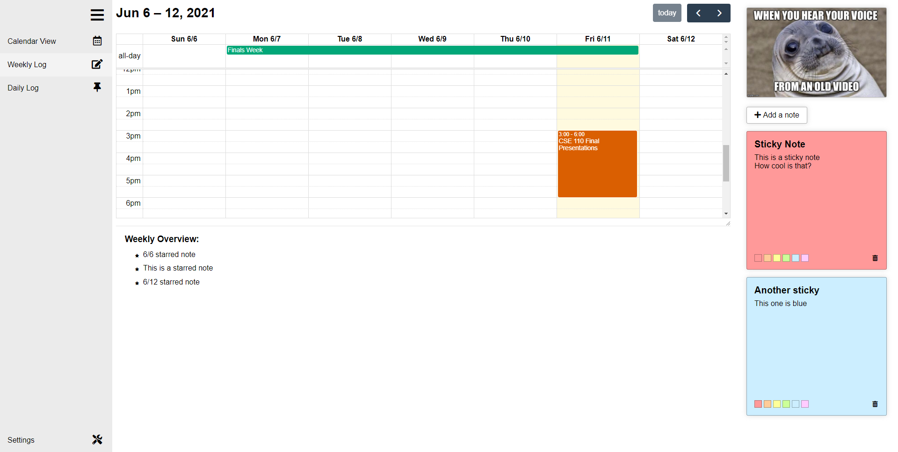

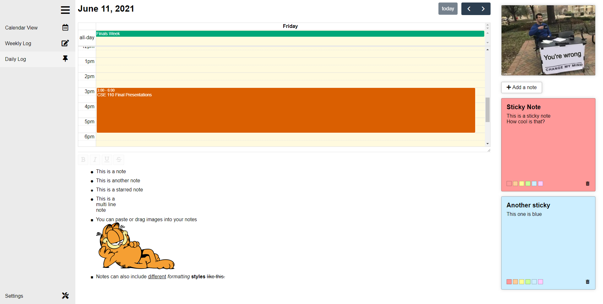

The weekly and daily logs display events and bullet notes for the currently selected week or day. Sticky notes and a random meme can also be found on these pages. The week or day can be changed using the arrow buttons and "today" button above the mini calendar.

### Mini Calendar

On the top half of the weekly and daily log pages, you will find a mini calendar displaying your events for the week or the day. 

### Random Meme

At the top right, a meme is selected randomly when the page is loaded in order to cheer you up and make you laugh. 

### Sticky Notes

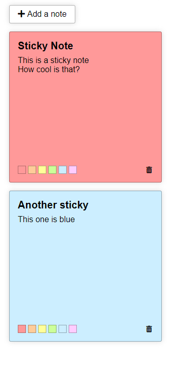

Sticky notes can be found on the right side of the daily and weekly logs. These sticky notes will remain constant across different days and weeks. Each note contains a title and a description, and there are six colors to choose from using the selector at the bottom left of each note. Sticky notes can be added through the button above the notes, and deleted using the button at the bottom right of each note.

### Weekly Overview

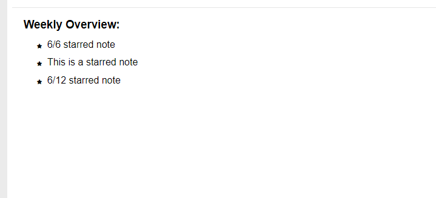

The weekly overview appears at the bottom half of the weekly log. This will display only important bullet notes from the currently selected week, which are designated using the star icon. Bullet notes cannot be edited from the weekly overview.

### Daily Bullet List

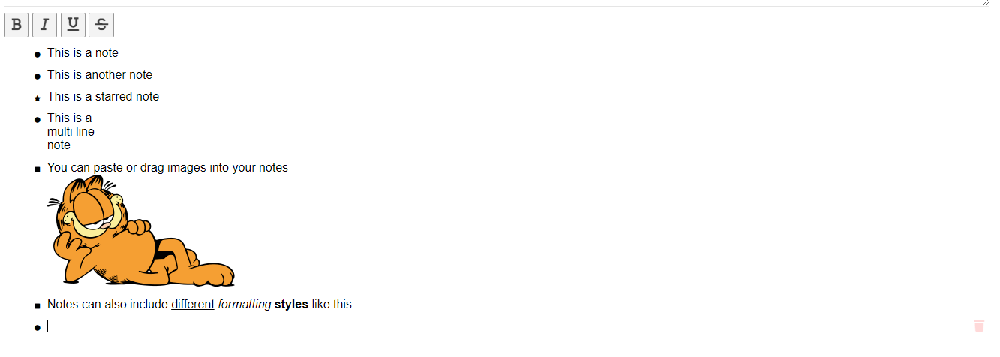

The daily bullet list allows you to create notes and tasks for each day. This list will be saved individually for each day, and will be saved automatically. Here is an overview for how to use the bullet list:

- To enter text into a bullet note, click the area to the right of the bullet point and start typing.
- Pressing Enter while typing into a bullet note will create a new bullet note below the current one and automatically select it.
- Pressing Shift-Enter will allow you to create a new line without adding a new note.
- Pressing Backspace on an empty note will delete that note.
- Notes can also be deleted using the trash can button on the far right.
- Text in a bullet note can be formatted using the Bold, Italic, Underline, and Strikethrough buttons above the list.
- Images can be copied and pasted or dragged into a note, including the random meme.
- Clicking the bullet point will bring up a dropdown, allowing you to change the bullet point style. 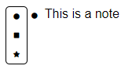
- Notes with a star bullet point will automatically be added to the weekly overview.

## Settings

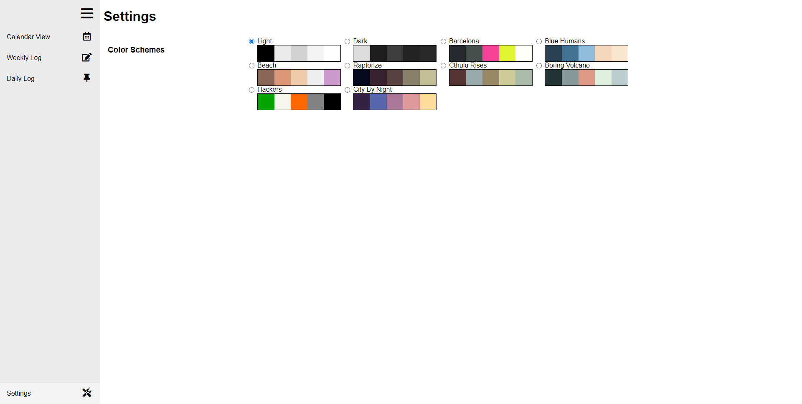

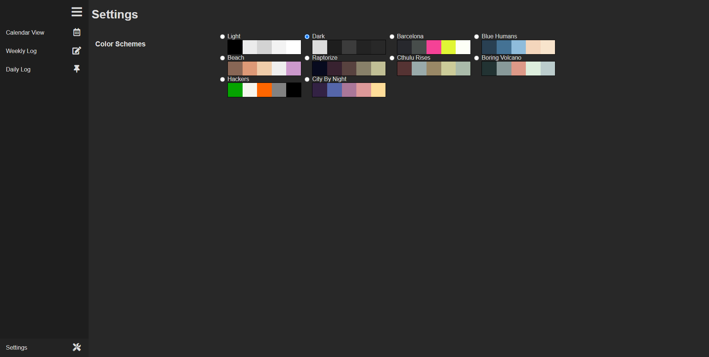

On the settings page, you can select from a variety of different color schemes for the web app. These color schemes will automatically apply to every page of the app.
