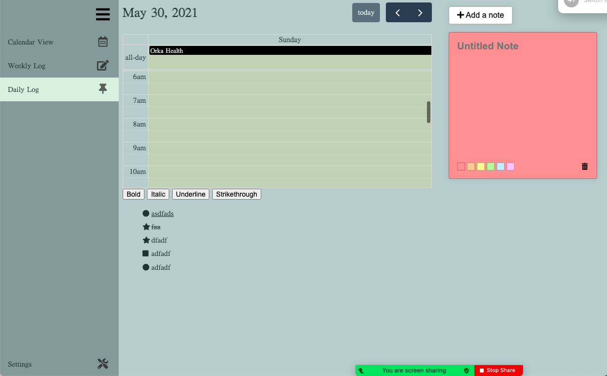

# Group#21: NinePlusTen

### Present:

Alexander Berryhill-Williams, Thomas Garry, Judy Liu, Jerry Guo, Tyler Holston, Lucas Bajoua, Jarrett Ratelle

### Absent:

### When and where:

May.30.2021, 7:00 - 8:00pm Sunday on Zoom

### Agenda

- Pull request issues, things to change and fix
- Sprint Review
- Testing assignments

### Sprint Review

- Alexander and Thomas worked on the bullet note function including autosaving bullet notes, select different bullet point icons with dropdown, storing note with star icon as "important notes" that will be shown the weekly log page. 
    - Initially faced issue with unable to change bullet point upon refresh, fixed issue
- Lucas fixed the meme generator by finding a new database and merging json files. The new database has better memes. 
- Lucas and Jarrett worked on autosaving bullet notes and sync it with daily log calendar dates. 
- Tyler and Jerry separated different views of calendar into weekly and daily log page. Faced an issue with event creation time where the date setup is incorrect, manually changed the end-date. Created an event entry form so that user can add event description and customize their events.
- Judy added the sticky note feature, faced the issue of not being able to change the sticky note color upon adding and deleting notes, fixed it.

### Screenshot

### What's Done
For the second sprint, we have the functionality and css of the calendar view and daily log almost done with a few things to be touched up. From the first sprint retrospective we learned that there is very little time for us to build, so for this sprint we started early and focused on fully implementing features from last sprint as opposed to starting new features. We have ultered the design of our bullet journal website to match our current features. In addition, we have implemented autosaving feature that allows the user to store bullets across different pages and dates!

### What's not done
We have not done unit and E2E testing because we wanted to have all features implemented before doing the testing. Our top priority in the next few days will be testing and people working with different features will communicate when implementing the tests.
There are also some features of the website that is not finalized, including saving the sticky notes, accessing notes from different weeks, adding time to events on calendar event creation form, changing website css to more user friendly, css of settings, add about section in settings. In general, we need to wrap up our app in the next week. 